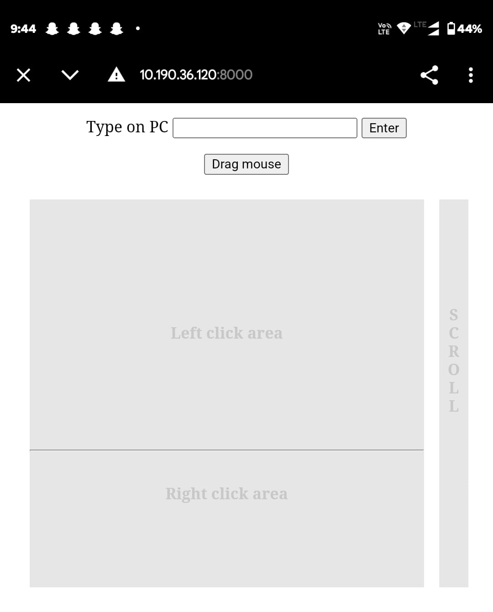

# Wireless Mouse Controller - Remote Control via Python

_A project by **Satya Suranjeet Jena**_

This project turns your smartphone into a **wireless mouse** using Python and a local server. It enables touch-based control for cursor movement, clicking, and scrolling—ideal for presentations or remote control scenarios.

---

## 🚀 Features

✅ **Real-Time Mouse Control** - Move the cursor using your smartphone.
✅ **Touchpad Emulation** - Use touch gestures for clicks and scrolling.
✅ **Automatic Local IP Detection** - Connect seamlessly within the same network.
✅ **QR Code for Easy Connection** - Scan the QR code to access the controller UI.
✅ **Minimal Latency** - Optimized for fast response.

---

## 📌 Prerequisites

🔹 Python 3.x installed on your system.
🔹 Install the required Python libraries:
  ```bash
  pip install flask pyautogui qrcode
  ```

---

## 🛠 How to Use

1️⃣ Clone or download this repository to your local machine.
2️⃣ Navigate to the project directory.
3️⃣ Run the script:
   ```bash
   python app.py
   ```
4️⃣ The script will:
   - Display a QR code in the terminal.
   - Print the server URL for reference.
   - Start the Flask server for the mouse controller.

5️⃣ Scan the QR code using your smartphone to access the remote mouse control UI.

---

## 📸 Example Output

When you run the script, you will see output similar to the following:

```
    █▀▀▀▀▀█      ▄█▀▀ █▀▀▀▀▀█    
    █ ███ █ ████▄▀█▄  █ ███ █    
    █ ▀▀▀ █ ██ █▀ ▄▀▀ █ ▀▀▀ █    
    ▀▀▀▀▀▀▀ █ ▀▄▀ ▀▄▀ ▀▀▀▀▀▀▀    
    ▀ ▀██▀▀▄▄▀▄    ▄█  ▀▀▀▀▄     
    ▀ ▀▄▄█▀ ▀ ▄▀  ▄ ▀ █ ▀▀ ▀█    
    █▀▀▀▀▄▀▄ ▀▄ ▄  ▄▀  ██▄▀█▀    
    █ ▀▄▀█▀ ▀▄█   █▀  ▄█▀▀ ▀█    
    ▀  ▀▀▀▀▀▄ ▀ ▀  ██  ▀▀█▄▀      
    █▀▀▀▀▀█ ▄▀▀█  ▄█ ▀ █▄▀██    
    █ ███ █ █▀▄▀▄▄ ▄█▀█▀██▀▀█    
    █ ▀▀▀ █ ▀▄█ ▄█▀█ ▀▀███▄ █    
    ▀▀▀▀▀▀▀ ▀ ▀ ▀ ▀▀ ▀ ▀▀▀▀▀▀    
Server URL: http://192.165.19.100:8000
```

---

## 🖼 Screenshots

Below are some screenshots of the wireless mouse controller UI:




---

## ⚠ Notes

🔸 Ensure that port `8000` is not being used by another application.
🔸 The server will only be accessible within the same network as the host machine.
🔸 Works best on touchscreen devices for gesture-based control.

---

## 📜 License

This project is licensed under the MIT License. Feel free to use and modify it as needed.

💡 **Creator:** Satya Suranjeet Jena 🚀

